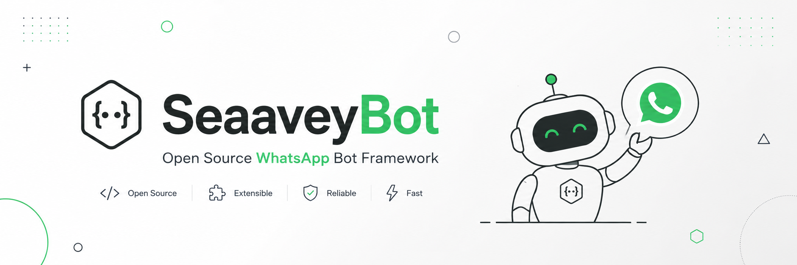

<p align="center">
  
</p>

<p align="center">
  <strong>Open Source WhatsApp Bot Framework</strong><br>
  Built with <a href="https://github.com/WhiskeySockets/Baileys">Baileys</a> and <a href="https://bun.sh">Bun</a>
</p>

<p align="center">
  <a href="#features">Features</a> •
  <a href="#installation">Installation</a> •
  <a href="#commands">Commands</a> •
  <a href="#docker">Docker</a> •
  <a href="#contributing">Contributing</a>
</p>

---

## Features

- 🔄 **Auto-reconnect** — Automatically reconnects on disconnect
- 📱 **QR & Pairing Code** — Login via QR code or pairing code
- ⚡ **Hot-reload** — Instant command reload in development
- 📂 **Category-based** — Organized command structure
- 🛡️ **Group Admin** — Full group management commands
- 🧩 **Extensible** — Easy to add new commands

## Requirements

- [Bun](https://bun.sh) v1.0+

## Installation

```bash
# Clone the repository
git clone https://github.com/seaavey/seaavey-bot.git
cd seaavey-bot

# Install dependencies
bun install

# Start the bot
bun run index.ts
```

Scan the QR code from `qr.png` or enter your phone number for pairing code.

## Commands

### General
| Command | Description |
|---------|-------------|
| `!menu` | Show all available commands |
| `!ping` | Check bot response speed |
| `!runtime` | Show bot uptime |
| `!owner` | Show owner contact |

### Group Admin
| Command | Description |
|---------|-------------|
| `!kick` | Kick a member |
| `!add` | Add a member |
| `!promote` | Promote to admin |
| `!demote` | Demote from admin |
| `!mute` | Close group (admin only chat) |
| `!unmute` | Open group |
| `!lock` | Lock group settings |
| `!unlock` | Unlock group settings |
| `!setname` | Change group name |
| `!setdesc` | Change group description |
| `!link` | Get invite link |
| `!revoke` | Reset invite link |
| `!hidetag` | Tag all without visible mention |
| `!tagall` | Tag all members |
| `!groupinfo` | Show group info |
| `!leave` | Bot leaves group (owner only) |

### Owner
| Command | Description |
|---------|-------------|
| `> code` | Evaluate JavaScript |
| `=> code` | Evaluate async JavaScript |

## Adding Commands

Create a file in `commands/<category>/`:

```ts
// commands/general/hello.ts
import { defineCommand } from "@/types";

export default defineCommand({
  name: "hello",
  description: "Say hello",
  handler: async (_sock, msg) => {
    await msg.reply("Hello! 👋");
  },
});
```

Commands are auto-loaded on startup. In dev mode, changes are hot-reloaded.

## Docker

```bash
docker build -t seaaveybot .
docker run -v ./auth:/app/auth seaaveybot
```

## Configuration

| Variable | Default | Description |
|----------|---------|-------------|
| `prefix` | `!` | Command prefix |
| `OWNER_NUMBER` | - | Owner WhatsApp number |
| `API_KEY` | - | API key for external services |

## Contributing

Contributions are welcome! Feel free to open an issue or submit a pull request.

## License

[MIT](LICENSE) © Muhammad Adriansyah (Seaavey)
